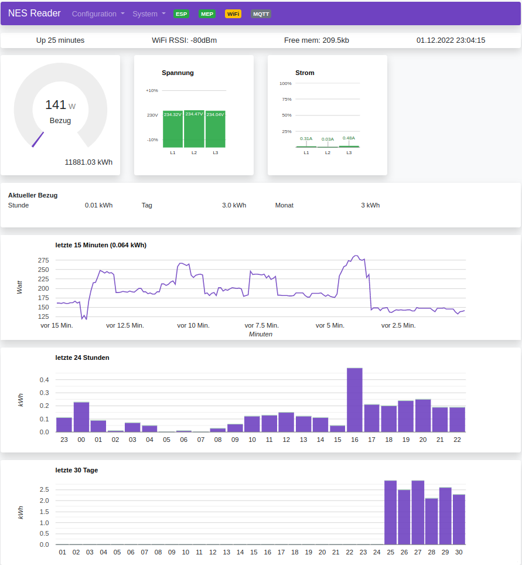

# AMS MQTT Bridge for NES-MEP

Major work in progress....for v2.0 ....download Revision v1.0 if you need a stabile working version.

This code is designed to decode data from NES (Networked Energy Services) electric smart meters installed in some countries in Europe (eg. Denmark and Austria, Switzerland).  
The data is presented in a graphical web interface and can also send the data to a MQTT broker which makes it suitable for home automation project.

This project is basically merging 2 other project into one:
1) amsreader-firmware (old name: AmsToMqttBridge) Rev, 2.2.16  which can found here: https://github.com/UtilitechAS/amsreader-firmware  and
2) OSGP Alliance Documentation for MEP (Multipurpose Expansion Ports) at https://github.com/OSGP-Alliance-MEP-and-Optical and the coding work from Graves Kilsgaard and Gert Lynge from www.dabbler.dk, in combination with help from NES and OSGP Alliance. See also : https://github.com/DabblerDK/MEP-SW-ESP32 

The data from NES (Echelon) smart meters is derived using the smart meters MEP (Multipurpose Expansion Port) which is using a bi-directional serial communication link. The communication is individually secured by a secret key called "MEP Basic Key" which the relevant electrical supply company (the one which own the smart meters) has to release to the customer. (In Austria this is supported by law.)


## Quick start:
1) Flash the ESP32 using files in "ESP32-binary" folder and according instructions in flash-readme.md . Later subsequent firmware changes can be done via Web interface by uploading a single firmware file. (Or by connecting ESP32 to a serial port which can also upload firmware.)
2) Connect to ESP32 "AP" WIFI web page. Initially the ESP32 starts in AP mode (= presenting an WIFI Access point named AMSMQTT). Connect your Laptop/Tablet to this Wifi network (AMS2MQTT)and open ESP32 web page which is by default on IP: 192.168.4.1 
3) Select "Generic ESP32" in the "Hardware" field, and enter your Wifi SSID, credentials and Hostname. Save&Reboot.
4) Connect to ESP32 web page. ESP32 should have connected to your Wifi and should be accessable by IP but also via its Hostname (Check out your Wifi router setup page for IP address.)
5) In "Configuration --> Meter": set "Main fuse" to eg.32A - this will define the scaling of the "Import" pie-plot. If you have a production device (eg. Photovoltaik, Wind turbine) enter a suitable kW value to field "Production capacity" - this will add a pie-plot for "Export" to the main web page, and to the day and month plots. Settings for Baud rate and Parity do not have an effect since Baud rate 9600 8E1 is actually hardcoded.
6) Still in "Configuration --> Meter": Enter the MEP Basic key in hex format, which should look similar like this: 58747A3B7E2C685656794F45404B79724F69562B .Enter such a 40 char long MEP basic key - which you must get from your local energy supplyer - into the "Encryption key" field. Best practice is to copy/paste from an editor. After pasting the 40 char long hex key a starting "0x" and 2 trailing zeros are shown....thats fine.
7) In "System --> GPIO": Depending on your hardware: set values to fields "LED" = 2 (works for my ESP32 Wemos D1 Module), AP button = 26 (GPIO pin where the AP button is connected to be able to reset ESP32 to initial AP mode). 
Attention: 26 is now the default which is used after each boot of ESP32. 
The "HAN" field is not doing anything - MEP serial communication is hard coded to Serial2 of ESP32.
8) For MQTT setup go to  "Configuration --> MQTT": Set the "Enable" checkmark, enter MQTTs broker IP into field "Host", enter a unique name to "Client ID" (unique for the MQTT broker) e.g. SM1, enter a MQTT topic into "Publish topic" field. This will be the base topic name. e.g. smartmeter.
9) 

## Hardware:
For hardware please check repository [Hardware](https://github.com/ehorvat1/NES-MEP-Reader/tree/main/Hardware) and also the development done by Dabbler group at www.dabbler.dk

## Notes:
1) This was tested only on NES Smart Meters Type: 83332-3I and 83334-3I 
2) There might be problems with power supply from NES Smart meter. It seems that some meters do not supply sufficient power to ESP32. As a result you might see frequent crashes or the serial communication to MEP port not working at all. If this happens remove the DCDC converter (!) and power the ESP32 module directly from USB.
3) NES (Networked Energy Services) smart meters were previously manufactured and sold with the "Echelon" brand name.
4) Currently only ESP32 is supported although you may find remainders of ESP8266 in the code. (Yes I want to make it ESP8266 compatible....)
5) MBK (MEP Basic Key) must be entered in its "hex" representation. This is a 40 char long string like this: 58747A3B7E2C685656794F45404B79724F69562B . You might receive a MEP Basic key in ascii format (just 20 char.) which has to be converted to hex manually - each single ASCII character gives a 2 digit hex number.
6) I have done some translations to German on the main web interface. A english version will follow.
7) I have changed the MQTT topic names for raw MQTT communication to better fit my home automation system (FHEM). Only RAW MQTT Payload is tested so far.
8) Work is still in progress....

## Web interface:
The web interface is very similar to original "amsreader-firmware". I have (not jet)  added a 60 Minute plot, made the plots interactive and translated to German language.



## Building this project with PlatformIO
To build this project, you need [PlatformIO](https://platformio.org/) installed.

It is recommended to use Visual Studio Code with the PlatformIO plugin for development.

[Visual Studio Code](https://code.visualstudio.com/download)

[PlatformIO vscode plugin](https://platformio.org/install/ide?install=vscode)

For development purposes, copy the ```platformio-user.ini-example``` to ```platformio-user.ini``` and customize to your preference. The code will adapt to the platform and board set in your profile. 
