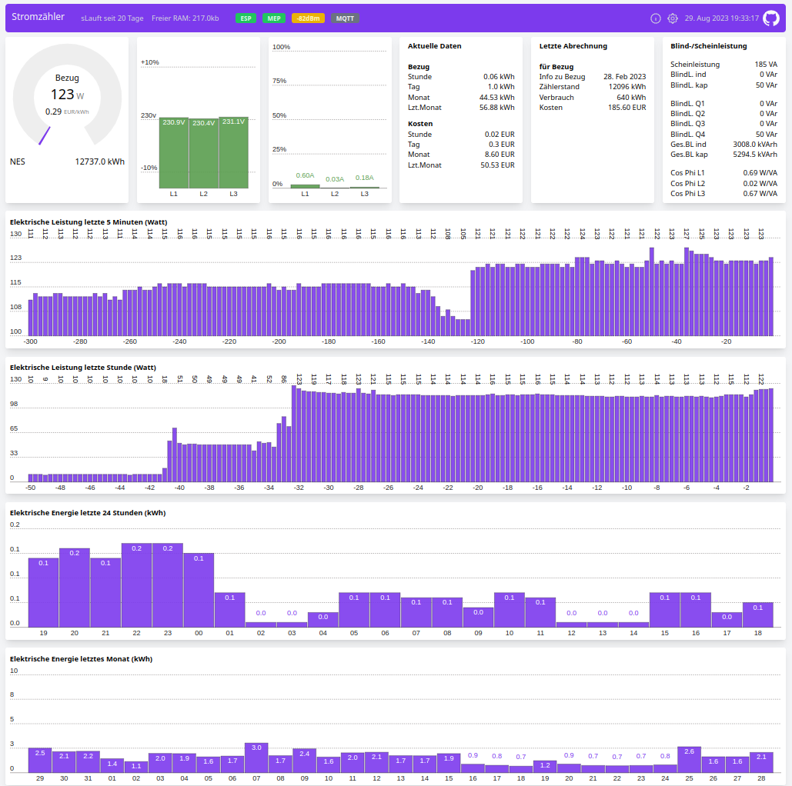

# AMS MQTT Bridge for NES-MEP

Now based on amsreader-firmware Rev, 2.2.17. (from 5th Mai 2023)

So it features: WebUI with new design. Works offline now. No Google plots any more.Last Month info. 

From my side: Fallback to Wifi AP can make AP button obsolete. 1hour plot

This code is designed to decode data from NES (Networked Energy Services) electric smart meters which are installed in some countries in Europe (eg. Denmark and Austria, Switzerland).  
The data is presented in a graphical web interface and can also send the data to a MQTT broker which makes it suitable for home automation project.

This project is basically merging 2 other project into one:
1) amsreader-firmware (old name: AmsToMqttBridge) Rev, 2.2.16  which can found here: https://github.com/UtilitechAS/amsreader-firmware  and
2) OSGP Alliance Documentation for MEP (Multipurpose Expansion Ports) at https://github.com/OSGP-Alliance-MEP-and-Optical and the coding work from Graves Kilsgaard and Gert Lynge from www.dabbler.dk, in combination with help from NES and OSGP Alliance. See also : https://github.com/DabblerDK/MEP-SW-ESP32 

The data from NES (Echelon) smart meters is derived using the smart meters MEP (Multipurpose Expansion Port) which is using a bi-directional serial communication link. The communication is individually secured by a secret key called "MEP Basic Key" which the relevant electrical supply company (the one which own the smart meters) has to release to the customer. (In Austria this is supported by law.)


## Quick start:
1) Flash the ESP32 using files in [ESP32-binaries](https://github.com/ehorvat1/NES-MEP-Reader/tree/main/ESP32-binaries) folder and according instructions of its readme.md file. Later subsequent firmware changes can be done via Web interface by uploading a single firmware file. (Or by connecting ESP32 to a serial port which can also upload firmware.)
2) Connect to ESP32 "AP" WIFI web page. Initially the ESP32 starts in AP mode (= presenting an WIFI Access point named Stromzaehler-abcd"). Connect your Laptop/Tablet to this Wifi network using **password: nesmep_esp32#V20** and open ESP32 web page which is by default on IP: 192.168.4.1

The AP SSID and password are also shown on serial connected terminal right after booting ESP32.

3) Press "NEXT" button on initial web page, and then on next page enter your Wifi SSID, credentials and optionally a hostname. Save&Reboot.
4) Connect to ESP32 web page.
ESP32 should have connected to your Wifi and should be accessable by IP but also via its Hostname (Check out your Wifi router setup page for IP address.)
5) Configuation. Open the Configuration web page (gear icon in header). Enter data to: "Price region, currency, fixed price. Set Power saving to Off, unceck Multipliers. Set up User interface to your needs.
6) Still on Configuration page: Make sure that "Meter is encrypted" checkbox is selected. Then enter the MEP Basic key in hex format. It should look similar like this: 58747A3B7E2C685656794F45404B79724F69562B .Enter/paste the 40 character long MEP basic key into the field below. You you have to get the MBK from your local energy supplyer first. Best practice is to copy/paste from an editor. After pasting the 40 char long hex key 2 trailing zeros are shown....thats fine.
7) Still on Configuration page: Set values to fields AP button = 26 (for IO26 the GPIO pin where the AP button is connected to be able to reset ESP32 to initial AP mode)."LED" = 2 (works for my ESP32 Wemos D1 Module). 
Attention: 26 is now the default which is used after each boot of ESP32. 
The serial port connection to the MEP port is fixed in the code to UART2 which is using IO16 & IO17. RTS (Request to send) is coded to IO05.
8) For MQTT setup: Enter a MQTTs broker IP into field "Host", a unique name to "Client ID" (unique for the MQTT broker) e.g. SM1 and enter a MQTT topic into "Publish topic" field. This will be the base topic name. e.g. smartmeter.
9) 

## Wifi function (STA mode or AP mode):
The option on configuration page in section Wifi called:  "Start a Wifi AP on home Wifi connection problem" will enable this:
If the configured Wifi (should be your home Wifi) can not be reached within app. 2 minutes the ESP32 will swap to Wifi AP mode and will present a AP named "Stromzaehler-abcd" with password mentioned in above pt. 2. 

Software will try to re-connect to the configured Wifi if no client is connected to this AP for 90 seconds. So if one is connected to AP Wifi the device will stay in AP mode. Please mind that most devices will do a automatic reconnect to the AP Wifi if the Wifi connection "Stromzaehler-abcd" was once used. This could prevent the ESP32 from automatically reconnecting to defined STA Wifi.

"AP" button still is an option to swap between configured WLAN and an Wifi Access point called "Stromzaehler-abcd". The AP button must be pressed longer than 5 seconds to swap Wifi mode.

## Hardware:
For hardware please check repository [Hardware](https://github.com/ehorvat1/NES-MEP-Reader/tree/main/Hardware) and also the development done by Dabbler group at www.dabbler.dk

## Notes:
1) This was tested only on NES Smart Meters Type: 83332-3I and 83334-3I 
2) There might be problems with power supply from NES Smart meter. It seems that some meters do not supply sufficient power to ESP32. As a result you might see frequent crashes or the serial communication to MEP port not working at all. If this happens remove the DCDC converter (!) and power the ESP32 module directly from USB.
3) NES (Networked Energy Services) smart meters were previously manufactured and sold with the "Echelon" brand name.
4) Currently only ESP32 is supported although you may find remainders of ESP8266 in the code. (Yes I want to make it ESP8266 compatible....)
5) MBK (MEP Basic Key) must be entered in its "hex" representation. This is a 40 char long string like this: 58747A3B7E2C685656794F45404B79724F69562B . You might receive a MEP Basic key in ascii format (just 20 char.) which has to be converted to hex manually - each single ASCII character gives a 2 digit hex number.
6) I have done some translations to German on the main web interface. A english version will follow.
7) Following MQTT topics should work in MQTT raw mode - they are published on a pure time basis even if they do not change the value.:
     - Publish topic + "/meter/MEP_data_ready"
     - Publish topic + "/meter/clock"
     - Publish topic + "/meter/import/active/accumulated"
     - Publish topic + "/meter/l1/voltage"
     - Publish topic + "/meter/l2/voltage"
     - Publish topic + "/meter/l3/voltage"
     - Publish topic + "/meter/l1/current"
     - Publish topic + "/meter/l2/current"
     - Publish topic + "/meter/l3/current"
     - Publish topic + "/meter/import/active"
     - Publish topic + "/meter/export/active"
     - Publish topic + "/meter/import/reactive"
     - Publish topic + "/meter/export/reactive"
     - Publish topic + "/realtime/import/hour"
     - Publish topic + "/realtime/import/day"
     - Publish topic + "/realtime/export/hour"
     - Publish topic + "/realtime/export/day"

So if you set the "Publish topic" in MQTT configuration to "smartmeter" the actual power used is published with full topic: smartmeter/meter/import/active

9) Only RAW MQTT Payload is tested so far. Others may work for above mentioned smart meter data.


## Web interface:
The web interface is very similar to original "amsreader-firmware". I have added a 60 Minute plot, and translated to German language.
The help icons on the configuration page are linked to original "amsreader-firmware" site. Serial Port and RTS Pin are described also on config page.



## Building this project with PlatformIO
To build this project, you need [PlatformIO](https://platformio.org/) installed.

It is recommended to use Visual Studio Code with the PlatformIO plugin for development.

[Visual Studio Code](https://code.visualstudio.com/download)

[PlatformIO vscode plugin](https://platformio.org/install/ide?install=vscode)

For development purposes, copy the ```platformio-user.ini-example``` to ```platformio-user.ini``` and customize to your preference. The code will adapt to the platform and board set in your profile. 
